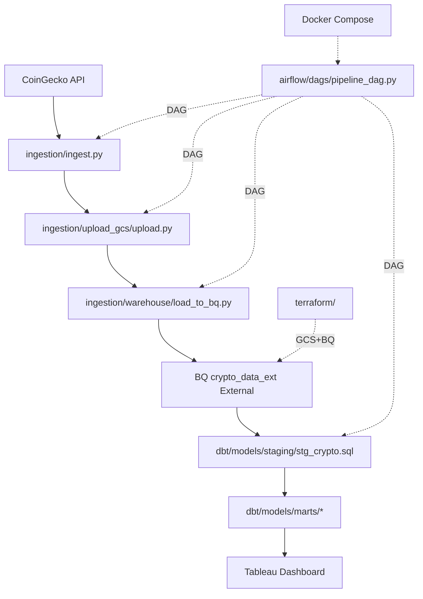
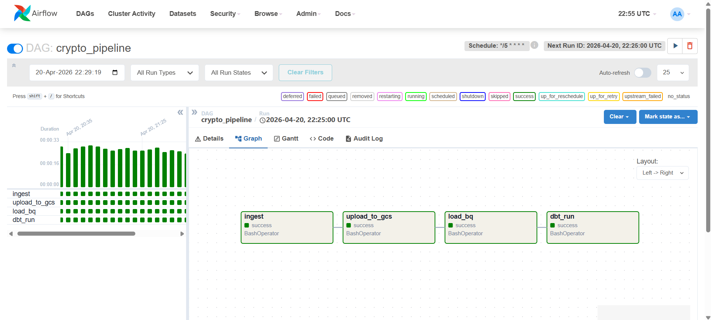

# Crypto Market Data Pipeline
[][airflow]
[][dbt]
[][docker]
[][bq]
[][python]

[airflow]: http://localhost:8080
[dbt]: docs/dbt-docs/index.html
[docker]: https://hub.docker.com/
[bq]: https://cloud.google.com/bigquery
[python]: https://python.org/

Automated ETL pipeline for real-time cryptocurrency data. Fetches top 300 coins from CoinGecko API every 5 minutes, processes to partitioned Parquet -> GCS -> BigQuery external table, transforms with dbt (staging + marts), orchestrated by Airflow, containerized with Docker. Powers Tableau dashboards for market insights.

## 📋 Table of Contents
- [Features](#-features)
- [Architecture Lineage](#architecture-lineage)
- [Quickstart](#-quickstart)
- [Terraform Infra](terraform/README.md)
- [Data Models](#-data-models)
- [Analytics & Visualization](#-analytics--visualization)
- [Screenshots](#screenshots)
- [Local Development](#-local-development)
- [Monitoring & Troubleshooting](#-monitoring--troubleshooting)
- [License](#-license)

## ✨ Features
- **📊 Real-time Ingestion**: Top 300 cryptos (market cap) from CoinGecko API.
- **🏗️ Partitioned Storage**: GCS Parquet (year/month/day/hour/min/run_id), BQ external table w/ Hive partitioning.
- **🔄 dbt Transformations**: Staging view + mart tables (aggregates, top-10, metrics).
- **🎯 Airflow Orchestration**: DAG runs every 5 mins: ingest → upload → load → dbt_run.
- **🐳 Dockerized**: One-command setup (Airflow + Postgres).
- **📈 Tableau-Ready**: Clean marts for dashboards (total MCAP, volume, top gainers, etc.).

## Architecture Lineage



**Data Flow**: API → Parquet (partitioned GCS) → BQ Ext Table → dbt (view → tables) → Tableau. Runs every 5 mins.

Data Volume: ~300 rows/run (17 cols: price, mcap, volume, etc.).

## 🚀 Quickstart
### Prerequisites
- Docker & Docker Compose
- Terraform (provision infra first)

### 1. Clone & Setup GCP Keys
```bash
git clone <your-repo>
cd capstone_DT
mkdir -p keys
cp /path/to/your-gcp-service-account.json keys/gcp-credentials.json  # .gitignore auto-excludes
```

### 2. Env Vars (`.env`)
```bash
GCP_PROJECT_ID=crypto_project1
BQ_DATASET=crypto_project1
GOOGLE_APPLICATION_CREDENTIALS=/opt/airflow/keys/gcp-credentials.json
```

### 3. Launch Pipeline
```bash
docker compose up -d  # Builds & starts Airflow (admin/admin)
```
- **Airflow UI**: http://localhost:8080
- DAG `crypto_pipeline` auto-runs every **5 mins**!

### 4. Verify
```bash
docker compose logs scheduler  # Check runs
bq query --use_legacy_sql=false 'SELECT * FROM \`crypto_project1.crypto_project1.crypto_data_ext\` LIMIT 10'
dbt run --profiles-dir dbt  # Manual (in dbt/venv)
```

### GCS Bucket (via .env GCS_BUCKET_NAME)
Full path: `gs://{{GCS_BUCKET_NAME}}/parquet/year={year}/month={month}/day={day}/hour={hour}/minute={minute}/{run_id}/data.parquet`

Example: `gs://crypto_project1-crypto-data/parquet/year=2024/month=10/day=15/hour=14/minute=30/abc12345/data.parquet`

## 📊 Data Models
**dbt Lineage**:

```
crypto_data_ext --> stg_crypto (view) --> agg_market_overview, top_10_crypto, top_10_crypto_latest, fact_crypto_metrics (tables)
```

**Key Schemas** (sample):
| Model | Materialized | Columns (excerpt) | Purpose |
|-------|--------------|-------------------|---------|
| `stg_crypto` | view | coin_id str, current_price float, market_cap float, price_change_24h float, ingestion_time timestamp | Clean source |
| `agg_market_overview` | table | ingestion_time, total_market_cap, total_volume, avg_price_change_24h | Market summary |
| `top_10_crypto` | table | rank, coin_id, market_cap, current_price | Leaderboard |

**Sample Query**:
```sql
SELECT * FROM `crypto_project1.crypto_project1.agg_market_overview` 
ORDER BY ingestion_time DESC LIMIT 24;  -- Last hour
```

## 📈 Analytics & Visualization
**Tableau Dashboard** connected to BQ `crypto_project1` dataset:
- **Top 10 Gainers/Losers** (24h % change, interactive filters).
- **Market Overview**: Total MCAP, volume trends (line/bar charts).
- **Coin Drilldown**: Prices, volumes over time.
- **Share**: [Tableau Public Link](https://public.tableau.com/views/YourDashboard) or screenshot below.


## Screenshots
| Airflow DAG | dbt Lineage | Tableau Overview |
|-------------|-------------|-----------------|
|  |  |  |

*(Add your actual screenshots to `/images/`)*

## 🔧 Local Development
- **Manual dbt**: `cd dbt && dbt deps && dbt run && dbt docs generate && dbt docs serve`
- **Test DAG**: Airflow UI → Trigger DAG manually.
- **Data Preview**: `gcloud storage ls gs://crypto_project1/parquet/ --recursive`

## 🚨 Monitoring & Troubleshooting
- **Logs**: `docker compose logs -f webserver`
- **BQ Costs**: External table = cheap (scan-only).
- **Common Fixes**:
  | Issue | Solution |
  |-------|----------|
  | Auth Error | Check `gcp-credentials.json` perms, env vars |
  | DAG Stuck | Unpause in UI, check scheduler logs |
  | dbt Fail | `dbt debug --profiles-dir dbt` |
  | No Data | Verify GCS uris, partitioning |


## 📄 License
MIT License - see [LICENSE](LICENSE) *(create if missing)*.
```
